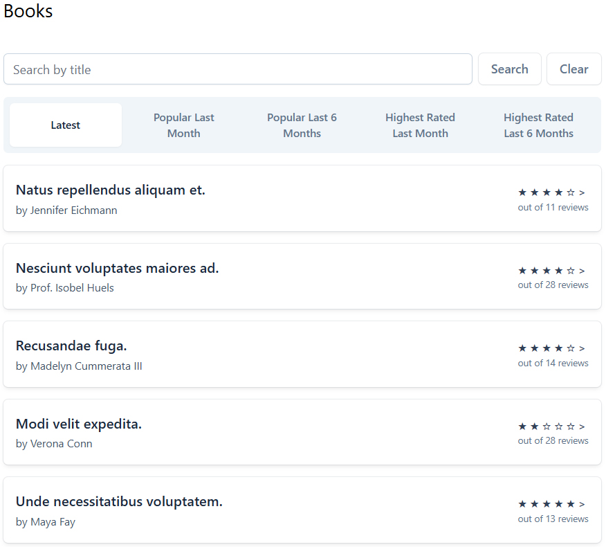
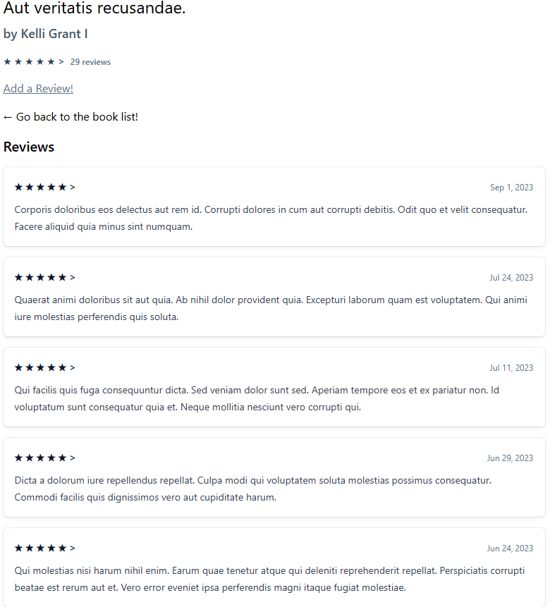

# 📚 Book Reviews

## 📝 Overview
A Laravel-based application that allows users to browse, read, and write reviews for various books. The platform offers a comprehensive collection of book reviews, enabling users to share their thoughts and discover new reads.

## 📸 Screenshot

## 🚀 Features
✔️ Browse a wide selection of books  
✔️ Read detailed reviews from other users  
✔️ Write and submit your own book reviews  
✔️ User authentication for personalized experiences  
✔️ Search functionality to find books and reviews quickly  
✔️ Responsive design for optimal viewing on all devices

## 📌 Usage
* **Browse Books**: Navigate through the collection to find books of interest.
* **Read Reviews**: Click on a book to read reviews submitted by other users.
* **Write a Review**: After logging in, select a book and submit your own review.
* **Search**: Use the search bar to quickly find specific books or authors.

## ❗ Known Issues
- No authentication (anyone can write a review).
    - 🔹 This feature is planned for a future update.
